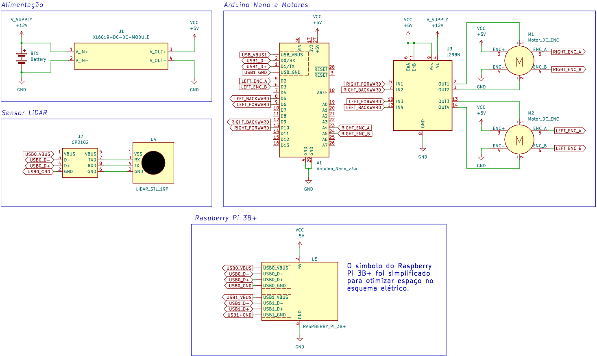

# Flashing de firmware: Arduino Nano

- Em seu ambiente de desenvolvimento de preferência, instale a IDE de Arduino do [site oficial](https://www.arduino.cc/en/software).

- Baixe o código-fonte do firmware para Arduino utilizado no MOGBE disponível em [`gsarenas/ros_arduino_bridge`](https://github.com/gsarenas/ros_arduino_bridge) e abra-o na IDE Arduino.

- Faça as alterações necessárias para combinar com seu setup. Atente-se às definições:
  - `BAUDRATE` em `ROSArduinoBridge.ino:linha 73`.
  - `LEFT_ENC_PIN_A` em `encoder_driver.h:linha 9`.
  - `LEFT_ENC_PIN_B` em `encoder_driver.h:linha 10`.
  - `RIGHT_ENC_PIN_A` em `encoder_driver.h:linha 13`.
  - `RIGHT_ENC_PIN_B` em `encoder_driver.h:linha 14`.
  - `RIGHT_MOTOR_BACKWARD` em `motor_driver.h:linha 6`.
  - `LEFT_MOTOR_BACKWARD` em `motor_driver.h:linha 7`.
  - `RIGHT_MOTOR_FORWARD` em `motor_driver.h:linha 8`.
  - `LEFT_MOTOR_FORWARD` em `motor_driver.h:linha 9`.

```{admonition} Atenção
---
class: attention
---
Garanta que a programação corresponda às conexões físicas. [Referência](https://github.com/gsarenas/mogbe/blob/main/img/mogbe_esquematico.png):

```

- Assumindo que você irá utilizar a mesma placa de desenvolvimento Arduino que o MOGBE, configure a IDE para compilar e gravar o código na placa:

  - `Ferramentas` -> `Placa` -> `Arduino AVR boards` -> `Arduino Nano`.
  - `Processador` -> `ATmega 328P (Old Bootloader)` caso esteja utilizando uma placa "paralela" e tenha dificuldades com a configuração padrão.
  - `Porta` -> `COMx` de acordo com sua porta conectada.

- Grave o código no Arduino Nano e teste o funcionamento da interface antes de integrá-la com ambiente ROS. Recomendo seguir o procedimento de [teste do firmware de Arduino para controle dos motores](#teste-do-firmware-de-arduino-para-controle-dos-motores).

---

## Teste do firmware de Arduino para controle dos motores

- No Raspberry Pi, supondo que o Arduino esteja conectado à porta ttyUSB0:

```bash
sudo pyserial-miniterm -e /dev/ttyUSB0 57600
```

- Nesse momento, é interessante testar o funcionamento do controle dos motores, bem como o funcionamento e sentido de giro dos encoders. Troque os pinos de sentido de giro dos motores e fases dos encoders se necessário. Alguns comandos importantes:
  - `e`: posição encoder de cada motor
  - `m`: velocidade dos motores (malha fechada) [enc_counts por loop]
  - `o`: velocidade dos motores (malha aberta)
  - `r`: reset valores de encoder
  - `u`: atualiza PID
