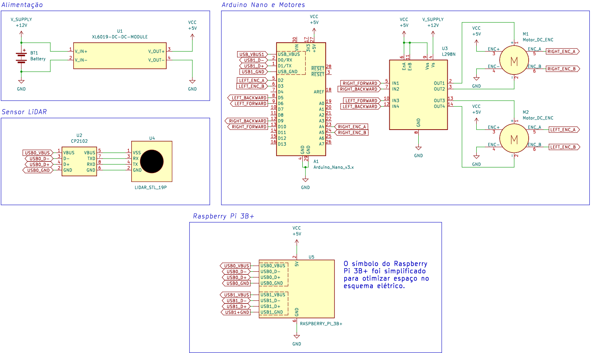

# Configuração Inicial

## Configuração de OS: Dev Machine

```{admonition} Nota
---
class: note
---
O projeto foi desenvolvido e implementado utilizando uma máquina virtual (guest machine) rodando Ubuntu 64-bit através do VMware Workstation 17 Player em um host machine Windows. A máquina virtual foi configurada utilizando definições padrão: 4 GB de memória RAM, 2 processadores, 40 GB de espaço em disco, etc.
```

- Certifique-se de que esteja rodando [Ubuntu Desktop versão Jammy Jellyfish 22.04.4 LTS](https://releases.ubuntu.com/jammy/).

```{admonition} Atenção
---
class: attention
---
Devido a limitações da ferramenta RViz, é necessário configurar o nome de usuário da dev mechine como `dev`. Caso não seja possível, será necessário fazer alterações nos arquivos `camera.xacro` e `lidar.xacro` da pasta `description` no pacote `mogbe`.
```

- Instale o ROS 2 versão Humble Hawksbill seguindo o [tutorial](https://docs.ros.org/en/humble/Installation/Ubuntu-Install-Debians.html) da documentação oficial. Prossiga até instalar `ros-humble-desktop` e `ros-dev-tools`, não é necessário instalar `ros-humble-base` para a dev machine.

- Para verificar a instalação, abra um terminal e rode o exemplo de `talker` em C++:

```bash
source /opt/ros/humble/setup.bash && ros2 run demo_nodes_cpp talker
```

- Abra um novo terminal e rode o exemplo de `listener` em Python:

```bash
source /opt/ros/humble/setup.bash && ros2 run demo_nodes_py listener
```

- Nesse exemplo, espera-se ver o `talker` publicando suas mensagens e o `listener` reproduzindo o que foi publicado.

- Para evitar a necessidade de configurar as variáveis de ambiente do diretório de instalação de ROS com o comando `source` toda vez que for rodar um programa, edite o seu arquivo `~/.bashrc`:

```bash
sudo nano ~/.bashrc
```

- Adicione `source /opt/ros/humble/setup.bash`à última linha do arquivo, feche `Ctrl+X`, salve `Y` e confirme `Enter`.

## Configuração de OS: Raspberry Pi

- Certifique-se de que esteja rodando Ubuntu Server versão Jammy Jellyfish 22.04.4 LTS. O sistema do Raspberry Pi será rodado no modo headless, ou seja, sem vídeo. É recomendado utilizar o `Raspberry Pi Imager` para fazer a instalação do sistema operacional: 
  - Selecione o modelo do dispositivo.
  - Em sistema operacional, selecione `Other general-purpose OS` -> `Ubuntu` -> `Ubuntu Server 22.04.4 LTS (64-bit)`.
  - Adicione as suas configurações personalizadas e garanta que a opção de habilitar conexão SSH foi configurada e habilitada.
  - Utilize um cartão SD com pelo menos 16 GB de memória (32 GB é recomendado).

- Após gravar o sistema operacional e ligar o Raspberry Pi, inicialize uma sessão `ssh` para comandá-lo. 

- Antes de seguir para a instalação do ROS 2 no sistema, vamos fazer algumas configurações que facilitarão o processo de desenvolvimento. Primeiro, configure seu `needrestart.conf`:

```bash
sudo nano /etc/needrestart/needrestart.conf
```

- Localize a linha com `#$nrconf{restart} = 'i';` e troque por `$nrconf{restart} = 'a';`. Isso fará com que o sistema reinicie os serviços necessários após atualizações automaticamente sem solicitar nossa intervenção.

- Caso esteja utilizando um Raspberry Pi com 1 GB de memória RAM, é **extremamente** recomendado configurar uma memória swap para permitir que o sistema lide com tarefas mais intensivas. Para isso, vamos utilizar o próprio cartão SD (não é recomendado utilizar drives USB por não serem rápidos o suficiente). Crie um arquivo swap de 4 GB (escolha o tamanho de acordo com sua disponibilidade). Note que o caminho da pasta `pi` se dá em função do nome de usuário:

```bash
sudo fallocate -l 4G /home/pi/swapfile
```

- Dê permissões para o usuário `root`:

```bash
sudo chmod 600 /home/pi/swapfile
```

- Converta o arquivo em memória swap:

```bash
sudo mkswap /home/pi/swapfile
```

- Ative a memória:

```bash
sudo swapon /home/pi/swapfile
```

- Verifique se foi ativada:

```bash
sudo swapon --show
```

- Torne a configuração permanente editando o arquivo `fstab`:

```bash
sudo nano /etc/fstab
```

- Adicione `/home/pi/swapfile swap swap defaults 0 0` à última linha do arquivo. Agora o Raspberry Pi irá manter a configuração de memória swap mesmo após reiniciar o dispositivo.

- Reinicie o sistema:

```bash
sudo reboot
```

- Siga o processo de instalação de ROS 2 (Humble Hawksbill) do [tutorial](https://docs.ros.org/en/humble/Installation/Ubuntu-Install-Debians.html) da documentação oficial. Prossiga até instalar `ros-humble-ros-base` e `ros-dev-tools`. Não é necessário instalar `ros-humble-desktop` para o Raspberry Pi.

- Para verificar a instalação, instale os pacotes de exemplo:

```bash
sudo apt install ros-humble-demo-nodes-cpp ros-humble-demo-nodes-py
```

- Abra um novo terminal e rode o exemplo de `talker` em C++:

```bash
source /opt/ros/humble/setup.bash && ros2 run demo_nodes_cpp talker
```

- Abra um novo terminal e rode o exemplo de `listener` em Python:

```bash
source /opt/ros/humble/setup.bash && ros2 run demo_nodes_py listener
```

- Nesse exemplo, espera-se ver o `talker` publicando suas mensagens e o `listener` reproduzindo o que foi publicado.

- Para evitar a necessidade de configurar as variáveis de ambiente do diretório de instalação de ROS toda vez que for rodar um programa, edite o seu `~/.bashrc`:

```bash
sudo nano ~/.bashrc
```

- Adicione `source /opt/ros/humble/setup.bash`à última linha do arquivo, feche `Ctrl+X`, salve `Y` e confirme `Enter`.

### (Opcional) Configuração de câmera

#### Raspberry Pi

- Para configurar uma câmera, supondo que será usada um módulo de câmera Raspberry Pi, instale os drivers:

```bash
sudo apt install libraspberrypi-bin v4l-utils
```

- Abra as configurações `raspi-config`:

```bash
sudo raspi-config
```

- `Advanced Options` -> `Camera` -> `Yes` para habilitar a interface da câmera.

- `Advanced Options` -> `SPI` -> `Yes` para habilitar a interface SPI.

- `Advanced Options` -> `I2C` -> `Yes` para habilitar a interface I2C.

- Edite suas configurações de boot:

```bash
sudo nano /boot/firmware/config.txt
```

- Encontre a linha que possui `camera_auto_detect=1` e mude para `camera_auto_detect=0`. Na linha abaixo de `display_auto_detect=1`, adicione a linha `start_x=1`.

- Reinicie:

```bash
sudo reboot
```

- Execute o `nó` driver da câmera:

```bash
ros2 run v4l2_camera v4l2_camera_node --ros-args -p image_size:="[240,160]" -p camera_frame_id:=camera_optical_link -p brightness:="60"
```

#### Dev Machine

- Com o `nó` driver da câmera rodando no Raspberry Pi, visualize a imagem com:

 ```bash
ros2 run rqt_image_view rqt_image_view 
```

## Flashing de firmware: Arduino Nano

- Em seu ambiente de desenvolvimento de preferência, instale a IDE de Arduino do [site oficial](https://www.arduino.cc/en/software).

- Baixe o código-fonte do firmware para Arduino utilizado no MOGBE disponível em [`gsarenas/ros_arduino_bridge`](https://github.com/gsarenas/ros_arduino_bridge) e abra-o na IDE Arduino.

- Faça as alterações necessárias para combinar com seu setup. Atente-se às definições:
  - `BAUDRATE` em `ROSArduinoBridge.ino:linha 73`.
  - `LEFT_ENC_PIN_A` em `encoder_driver.h:linha 9`.
  - `LEFT_ENC_PIN_B` em `encoder_driver.h:linha 10`.
  - `RIGHT_ENC_PIN_A` em `encoder_driver.h:linha 13`.
  - `RIGHT_ENC_PIN_B` em `encoder_driver.h:linha 14`.
  - `RIGHT_MOTOR_BACKWARD` em `motor_driver.h:linha 6`.
  - `LEFT_MOTOR_BACKWARD` em `motor_driver.h:linha 7`.
  - `RIGHT_MOTOR_FORWARD` em `motor_driver.h:linha 8`.
  - `LEFT_MOTOR_FORWARD` em `motor_driver.h:linha 9`.

```{admonition} Atenção
---
class: attention
---
Garanta que a programação corresponda às conexões físicas. [Referência](https://github.com/gsarenas/mogbe/blob/main/img/mogbe_esquematico.png):

```

- Assumindo que você irá utilizar a mesma placa de desenvolvimento Arduino que o MOGBE, configure a IDE para compilar e gravar o código na placa:

  - `Ferramentas` -> `Placa` -> `Arduino AVR boards` -> `Arduino Nano`.
  - `Processador` -> `ATmega 328P (Old Bootloader)` caso esteja utilizando uma placa "paralela" e tenha dificuldades com a configuração padrão.
  - `Porta` -> `COMx` de acordo com sua porta conectada.

- Grave o código no Arduino Nano e teste o funcionamento da interface antes de integrá-la com ambiente ROS. Recomendo seguir o procedimento de [teste do firmware de Arduino para controle dos motores](#teste-do-firmware-de-arduino-para-controle-dos-motores).

### Teste do firmware de Arduino para controle dos motores

- No Raspberry Pi, supondo que o Arduino esteja conectado à porta ttyUSB0:

```bash
sudo pyserial-miniterm -e /dev/ttyUSB0 57600
```

- Nesse momento, é interessante testar o funcionamento do controle dos motores, bem como o funcionamento e sentido de giro dos encoders. Troque os pinos de sentido de giro dos motores e fases dos encoders se necessário. Alguns comandos importantes:
  - `e`: posição encoder de cada motor
  - `m`: velocidade dos motores (malha fechada) [enc_counts por loop]
  - `o`: velocidade dos motores (malha aberta)
  - `r`: reset valores de encoder
  - `u`: atualiza PID
