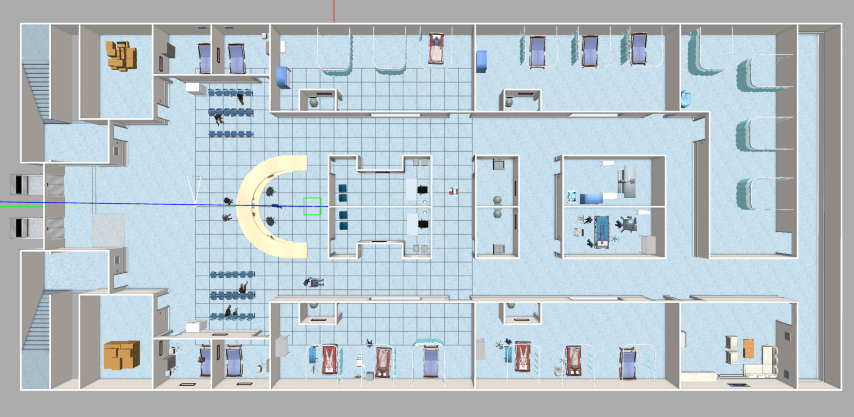
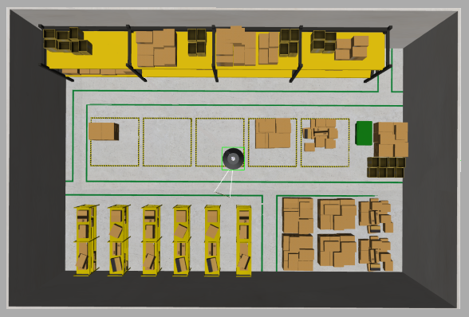

# Configuração da área de trabalho

A área de trabalho (workspace) do projeto foi desenvolvida de modo que possa ser compartilhada entre dev machine e Raspberry Pi, ou seja, o mesmo procedimento de compilação pode ser seguido para ambos os casos. O código principal do projeto está localizado no repositório [`gsarenas/mogbe`](https://github.com/gsarenas/mogbe), mas também é feito uso de outros repositórios (submódulos):

- [`gsarenas/ros_arduino_bridge`](https://github.com/gsarenas/ros_arduino_bridge): firmware de Arduino para controlar os motores através de uma interface de comunicação serial.
- [`gsarenas/serial`](https://github.com/gsarenas/serial): biblioteca para interface de porta serial RS-232
- [`gsarenas/diffdrive_arduino`](https://github.com/gsarenas/diffdrive_arduino): um `nó` que faz interface entre o `diff_drive_controller` de `ros_control` e o firmware de Arduino `ros_arduino_bridge`.
- [`gsarenas/ldlidar_stl_ros2`](https://github.com/gsarenas/ldlidar_stl_ros2): SDK desenvolvido pela Shenzhen LDROBOT Co., LTD. para interface do sensor LiDAR LD19 com ROS 2.

Apesar desses pacotes serem referenciados como submódulos e o MOGBE depender deles para funcionar, a estrutura do projeto é organizada em múltiplos repositórios. O intuito dessa escolha é que, futuramente, estudantes de robótica móvel repliquem o projeto e identifiquem cada pacote como um recurso disponível. A partir disso, espera-se que derivem seus respectivos projetos de acordo com o que for necessário, não se prendendo a um repositório específico. Em projetos com ROS, é muito comum o desenvolvedor se basear em soluções já existentes e integrá-las para sua finalidade.

- Crie a área de trabalho ROS (lembre-se que o procedimento é o mesmo para o Raspberry Pi e a dev machine). 

```{admonition} Atenção
---
class: attention
---
Caso precise usar um nome de pasta diferente de `mogbe_ws` será necessário fazer alterações nos arquivos `camera.xacro` e `lidar.xacro` da pasta `description` do pacote `mogbe`
```

```bash
mkdir -p ~/mogbe_ws/src && cd ~/mogbe_ws/
```

```{admonition} Atenção
---
class: attention
---
O `main` branch do repositório possui `worlds` mais elaborados para a simulação (tabela abaixo), o que torna o repositório mais pesado (~130 MB).
```

| [`hospital.world`](https://github.com/gsarenas/aws-robomaker-hospital-world)  | [`small_warehouse.world`](https://github.com/gsarenas/aws-robomaker-small-warehouse-world) |
| :-----------: | :-----------: |
|  |  |

- Caso deseje utilizá-los, clone o repositório normalmente:

```bash
git clone https://github.com/gsarenas/mogbe.git src/mogbe
```

```{admonition} Atenção
---
class: attention
---
Caso não necessite dessas simulações - ou esteja criando a área de trabalho do Raspberry Pi - e prefira um repositório mais leve (~20 MB), clone a branch `mogbe-light`:
```

```bash
git clone --single-branch -b mogbe-light https://github.com/gsarenas/mogbe.git src/mogbe
```

- Clone os submódulos:

```bash
git clone https://github.com/gsarenas/serial.git src/serial && \
git clone https://github.com/gsarenas/diffdrive_arduino.git src/diffdrive_arduino && \
git clone https://github.com/gsarenas/ldlidar_stl_ros2.git src/ldlidar_stl_ros2
```

<!--
- Inicie `rosdep` se ainda não tiver feito:

```bash
sudo rosdep init
```

- Instale as dependências:

```bash
architecture=$(uname -m) && \
rosdep update && rosdep install --from-paths src --ignore-src -y --os=ubuntu:$architecture
```

- `rosdep` deve ser suficiente para instalar os pacotes necessários. Ignore qualquer erro relacionado a pacotes não listados para a arquitetura `x86_64` ou `amd64`. Se houver qualquer outro erro, as dependências da dev machine se resolvem com:
-->

- Instale as dependências da dev machine (somente dev machine):

```bash
sudo apt install ros-humble-gazebo-ros-pkgs \
ros-humble-ros2-control \
ros-humble-ros2-controllers \
ros-humble-gazebo-ros2-control \
ros-humble-slam-toolbox \
ros-humble-navigation2 \
ros-humble-nav2-bringup \
ros-humble-twist-mux \
ros-humble-xacro \
ros-humble-image-transport-plugins \
ros-humble-rqt-image-view
```

<!--
- No caso do Raspberry Pi, ignore qualquer erro relacionado a pacotes não listados para a arquitetura `aarch64` ou `arm64`. Caso tenha algum outro erro, as dependências do Raspberry Pi se resolvem com:
-->

- Instale as dependências do Raspberry Pi (somente Raspberry Pi):

```bash
sudo apt install ros-humble-demo-nodes-cpp \
ros-humble-demo-nodes-py \
ros-humble-ros2-control \
ros-humble-ros2-controllers \
ros-humble-slam-toolbox \
ros-humble-navigation2 \
ros-humble-nav2-bringup \
ros-humble-twist-mux \
ros-humble-xacro \
ros-humble-image-transport-plugins \
ros-humble-v4l2-camera
```

- Compile o repositório:

```bash
colcon build --symlink-install
```

> Ignore o aviso de stderr da compilação da biblioteca `serial`. Trata-se de um aviso de descontinuidade, não falha na compilação.

- Com isso, a área de trabalho está configurada, compilada e pronta para execução. Se você seguiu todos os passos de maneira correta, é esperado a seguinte estrutura para a pasta:

Estrutura esperada em `~/mogbe_ws`:

    .
    ├── build
    ├── install
    ├── log
    └── src
        ├── diffdrive_arduino
        ├── ldlidar_stl_ros2
        ├── mogbe
        └── serial

> O conteúdo das pastas `build`, `install` e `log` não é relevante no momento. Basta verificar que elas foram criadas após a `build`.