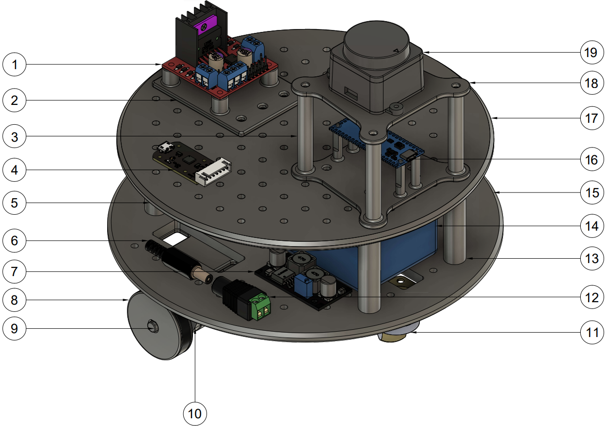

# Componentes MOGBE

Abaixo segue uma relação dos componentes utilizados no MOGBE e os custos com preços baseados em Novembro de 2024:

| ID | Denominação | Quantidade | Custo unitário [R$] | Custo total [R$] |
| -- | ----------- | ---------- | ------------------- | ---------------- |
| 1 | Driver ponte H L298N | 1 | 25,40 | 25,40 |
| 2 | Suporte impresso ponte H | 1 | 130,00 | 130,00 |
| 3 | Suporte impresso LiDAR e Arduino | 1 | 106,00 | 106,00 |
| 4 | Conversor USB CP2102 (kit D500) | --- | --- |
| 5 | Raspberry Pi 3B+ | 1 | 400,00 | 400,00 |
| 6 | Conversor DC macho 2,1 x 5,5 mm | 1 | 4,00 | 4,00 |
| 7 | Conversor DC-DC XL6019 | 1 | 24,60 | 24,60 |
| 8 | Roda impressa 40 mm | 2 | 40,00 | 80,00 |
| 9 | Motor DC 12V 333R RPM com encoder | 2 | 58,10 | 116,20 |
| 10 | Mancal para motor impresso | 2 | 65,00 | 130,00 |
| 11 | Rodízio giratório | 1 | 15,10 | 15,10 |
| 12 | Concentor DC fêmea 5,5 mm | 1 | 4,00 | 4,00 |
| 13 | Suporte impresso colune | 4 | 15,00 | 60,00 |
| 14 | Bateria 12 V 5000 mAh | 1 | 109,20 | 109,20 |
| 15 | Base impressa primeiro andar | 1 | 200,00 | 200,00 |
| 16 | Arduino Nano | 1 | 34,80 | 34,80 |
| 17 | Base impressa segundo andar | 1 | 200,00 | 200,00 |
| 18 | Base impressa sesnro LiDAR | 1 | 125,00 | 125,00 |
| 19 | Sensor LiDAR STL-19P (kit D500) | 1 | 368,80 | 368,80 |
| Total | 2.000,00 | 