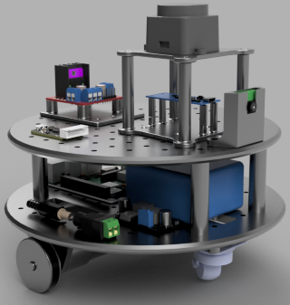

<!--.. mogbe documentation master file, created by
   sphinx-quickstart on Fri May 24 20:02:36 2024.
   You can adapt this file completely to your liking, but it should at least
   contain the root `toctree` directive.

Bem-vindo à documentação do MOGBE!
==================================

- Apresentação
- Direcionamento

.. toctree::
   :hidden:
   
   1_visao_geral/index.md
   2_configuracao_inicial/index.md
   3_area_de_trabalho/index.md
   4_rodando_exemplo/index.md
   5_cheat_sheet/index.md
   6_extras/index.md
   7_teste/index.md


Indices and tables
==================

* :ref:`genindex`
* :ref:`modindex`
* :ref:`search`-->

# Bem-vindo à documentação do MOGBE!

**MOGBE** - **Mo**bile **G**eneral Ro**b**ot for **E**ducation: um robô autônomo para aprendizagem de robótica móvel com ROS no ensino superior

```{eval-rst}
.. image:: img/mogbe_render_small.png
   :align: left
   :width: 30%
```
O MOGBE é fruto de um Trabalho de Conclusão de Curso (TCC) desenvolvido por alunos do curso de Engenharia de Controle e Automação da Faculdade Engenheiro Salvador Arena (FESA). Apesar de sua proposta primária de ser integrada às aulas da FESA, o código-fonte da plataforma está disponível ao público geral pois ela foi desenvolvida a fim de permitir que entusiastas com conhecimentos em eletrônica e programação possam utilizá-la para aprofundar seus conhecimentos em robótica móvel ou até construírem sua própria solução.


<!--```{eval-rst}
.. image:: img/mogbe_render_small.png
    :width: 45%
.. image:: img/demo_tcc_small.gif
    :width: 45%
```-->

<!--
|  |  |
| --- | --- |
-->

```{toctree}
:hidden:
visao_geral/index.md
hardware/index.md
configuracao_inicial/index.md
area_de_trabalho/index.md
rodando_exemplo/index.md
cheat_sheet/index.md
debugging/index.md
extras/index.md
```