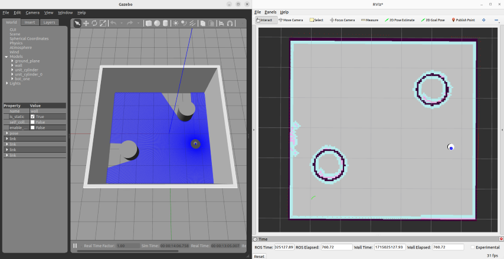

# Rodando uma simulação

- Simulações são executadas na dev machine e independem do Raspberry Pi. Para executar um exemplo, garanta que esteja na pasta `mogbe_ws` e que as variáveis de ambiente estejam configuradas:

```bash
cd ~/mogbe_ws && source install/setup.bash
```

- Execute a simulação de teste no ambiente `wall.world`:

```bash
ros2 launch mogbe mogbe_simulation_all.launch.py world:=./src/mogbe/worlds/wall.world
```

- O ambiente de simulação Gazebo, a ferramenta de visualização RViz e demais `nós` devem inicializar. Lembre-se que o Gazebo é o simulador 3D, enquanto o RViz como o robô "enxerga" o mundo com as informações limitadas que tem.



- Para controle manual do robô na simulação, abra um novo terminal e rode o `nó` de comando `teleop_twist_keyboard`:

```bash
ros2 run teleop_twist_keyboard teleop_twist_keyboard --ros-args -r /cmd_vel:=/cmd_vel_joy
```

```{admonition} Dica
---
class: tip
---
É necessário que o terminal com o `teleop_twist_keyboard` esteja em foco para controlar o robô manualmente.
```