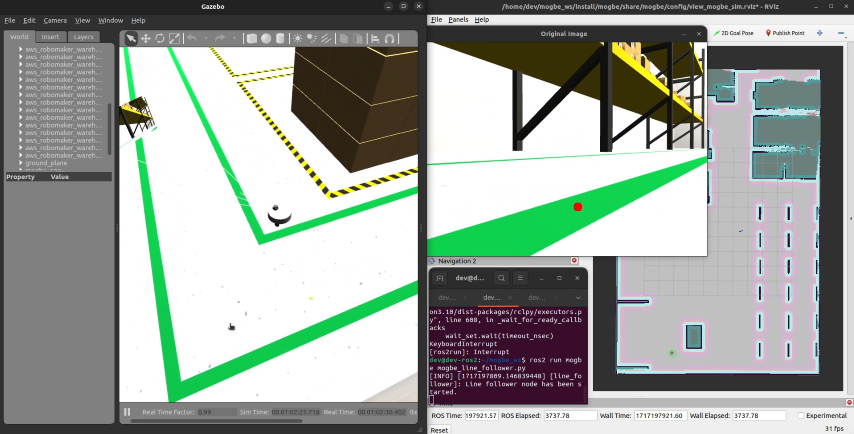

# Segue faixa

O MOGBE também tem uma função "segue faixa". Implementamos a função "segue faixa" em um `nó` denominado `mogbe_line_follower.py`. Essa função funciona tanto em ambiente de simulação quanto em ambiente real. O `nó` funciona da seguinte forma:

1. É dado como entrada a imagem da câmera através do tópico `/camera/image_raw`;

2. Processamos a imagem recebida para filtrar a cor verde através de uma máscara;

3. Identificamos a linha e calculamos sua centróide;

4. Calculamos o erro da centróide em relação ao centro da imagem e ajustamos a pose do MOGBE através do tópico `/cmd_vel`, mantendo uma velocidade linear em `x` constante.



## Rodando o segue faixa

```{admonition} Nota
---
class: note
---
Vale lembrar que essa função independe das demais funções do MOGBE. Ou seja, não precisamos de um mapa ou da navegação autônoma funcionando. Basta encontrar uma linha verde com sua câmera e rodar o `nó`.
```

- Para testar essa função, inicialize o MOGBE normalmente com a câmera, seja o arquivo `launch` completo (`mogbe_simulation_all.launch.py`) ou o mais simples (`mogbe_simulation.launch.py`). Dentro da main branch do repositório do MOGBE, há um `world` com uma faixa verde compatível com a função segue faixa. Vamos rodar um exemplo com uma configuração mais simples:

```bash
ros2 launch mogbe mogbe_simulation.launch.py world:=./src/mogbe/worlds/small_warehouse.world
```

Caso esteja rodando a configuração mais simples, é necessário rodar o `twist_mux`:

```bash
cd ~/mogbe_ws && ros2 run twist_mux twist_mux --ros-args --params-file ./src/mogbe/config/twist_mux.yaml --remap /cmd_vel_out:=/diff_cont/cmd_vel_unstamped
```

- Na simulação, a câmera já é inicializada automaticamente, independente do caso. Então não é necessário fazer mais nada para rodar o segue faixa. Para o robô físico, siga os [passos para inicialização da câmera](https://mogbe.readthedocs.io/pt/latest/configuracao_inicial/configuracao_camera.html). Com a câmera e `twist_mux` funcionando, a preparação para o segue faixa está pronta. Antes de iniciá-lo, garanta que o executável do `nó` tenha as permissões necessárias:

```bash
cd ~/mogbe_ws && sudo chmod +rx src/mogbe/scripts/mogbe_line_follower.py
```

- Rode o `nó`:

```bash
source install/setup.bash && ros2 run mogbe mogbe_line_follower.py
```

```{admonition} Dica
---
class: tip
---
Tenha o `teleop_twist_keyboard` preparado para assumir o controle do robô caso necessário. Com o `twist_mux` rodando, ambos os comandos são aceitos. Nesse caso, `teleop_twist_keyboard` tem maior prioridade por questão de segurança.

```bash
ros2 run teleop_twist_keyboard teleop_twist_keyboard --ros-args --remap /cmd_vel:=/cmd_vel_joy
```

